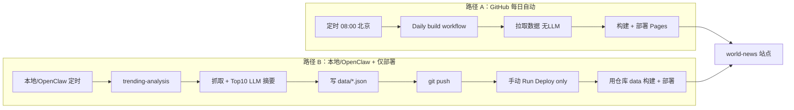
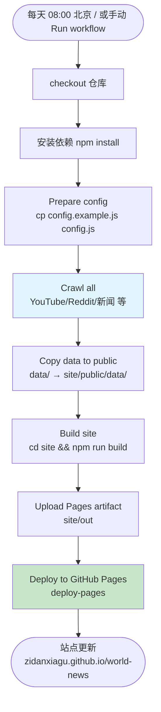
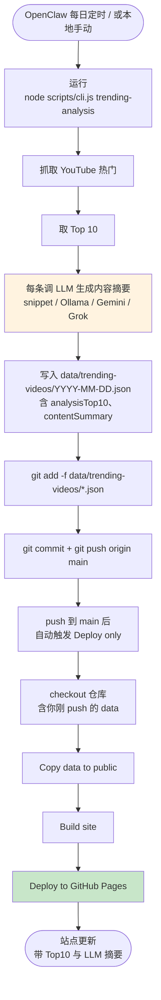
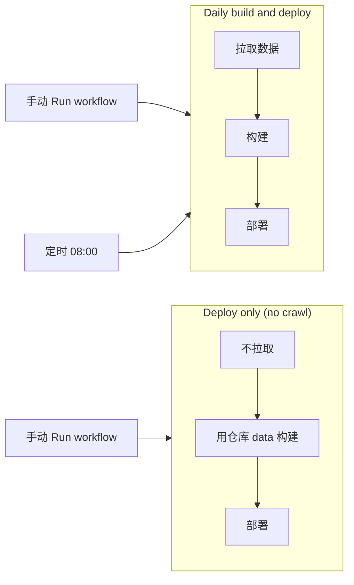
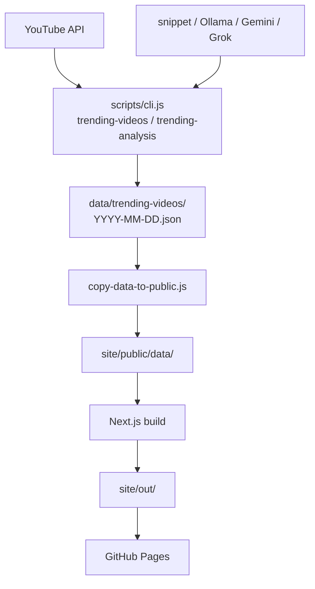

# 每日调用、执行到部署 GitHub 流程图

---

## 总览：两条主路径

---

## 路径 A：GitHub 每日自动（无 LLM）

每天 08:00 北京时间（或手动 Run workflow）触发，拉取数据、构建、部署。**不跑大模型**，站点展示的是「无内容摘要」的数据。

| 步骤 | 说明 |
|------|------|
| Crawl all | 用仓库 Secrets 的 YOUTUBE_API_KEY 等拉取数据；**无 LLM**，无每条视频 contentSummary |
| Copy data to public | 把本次爬到的 data 拷到 site/public/data，供构建时读 |
| Deploy | 用 GitHub Actions 的 deploy-pages 发布到 Pages |

---

## 路径 B：本地/OpenClaw 抓取 + LLM 分析 → 推送到 GitHub → 仅部署

在本地或 OpenClaw 每日定时跑「热门分析」，再把带摘要的数据推到仓库，最后在 GitHub 上触发「仅部署」，站点就会展示 **Top10 + 内容摘要**。

| 阶段 | 说明 |
|------|------|
| 本地/OpenClaw | `trending-analysis` = 抓热门 + 对 Top10 逐条做摘要（snippet/Ollama/Gemini/Grok），写回 JSON |
| 推送 | 把 `data/trending-videos/YYYY-MM-DD.json` 提交并 push 到 main；**push 后会自动触发 Deploy only**，无需再手动点 Run workflow |
| 仅部署 | **Deploy only (no crawl)** 用仓库里已有 data 构建并部署到 Pages |

### 路径 B 你还缺什么（自检）

| 项 | 说明 | 如何补上 |
|----|------|----------|
| **1. 本地 config.js** | YouTube apiKey + 摘要来源（summaryVideoProvider：snippet/ollama/gemini/grok） | 复制 config.example.js 为 config.js，填密钥；用免费可设 `summaryVideoProvider: 'snippet'` |
| **2. 至少跑通一次** | 本地要有过一条 `data/trending-videos/YYYY-MM-DD.json`（含 analysisTop10） | 执行 `node scripts/cli.js trending-analysis`，看 data 目录是否生成当日 JSON |
| **3. 推送 data** | 仓库里要有 data 文件，Deploy only 才会用到 | `git add -f data/trending-videos/YYYY-MM-DD.json` → commit → push；或用脚本 `./scripts/run-daily-trending-analysis-and-push.sh` 一步完成分析+推送 |
| **4. OpenClaw 定时（可选）** | 每天自动跑分析（+ 可选自动推送） | OpenClaw 里添加定时任务：执行 `run-daily-trending-analysis.sh`（仅分析）或 `run-daily-trending-analysis-and-push.sh`（分析并 push，需本机 git 能 push） |
| **5. 本机 git 能 push** | 若用「分析+推送」脚本或手动推送 | `git remote -v` 确认 origin 指向正确仓库；SSH 或 token 已配置，能 `git push origin main` |

---

## 两个 Workflow 分工

| Workflow | 触发 | 是否拉取数据 | 是否跑 LLM | 用途 |
|----------|------|--------------|------------|------|
| **Daily build and deploy** | 定时 08:00 / 手动 | ✅ 是（用 Secrets） | ❌ 否 | 每日自动更新站点，数据无摘要 |
| **Deploy only (no crawl)** | 仅手动 | ❌ 否 | ❌ 否 | 你本地跑完 analysis 并 push 后，用仓库 data 重新构建并部署 |

---

## 数据流简图

说明：**Crawl** 产出 JSON 到 `data/`；**Copy** 把 data 拷到 `site/public/data/`；**Build** 把站点（含读 public/data）打成静态 `site/out/`；**Pages** 部署的是 `site/out/`。
